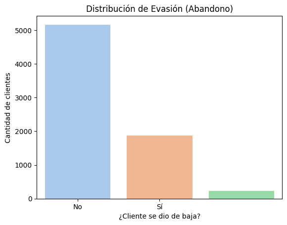
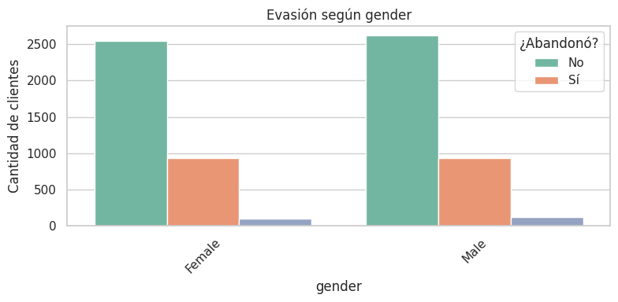
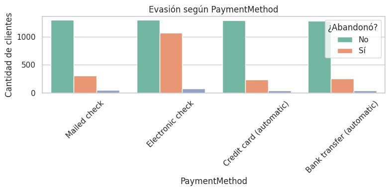
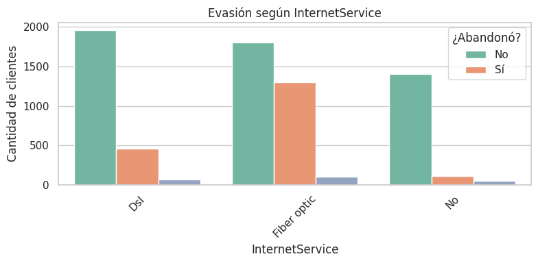
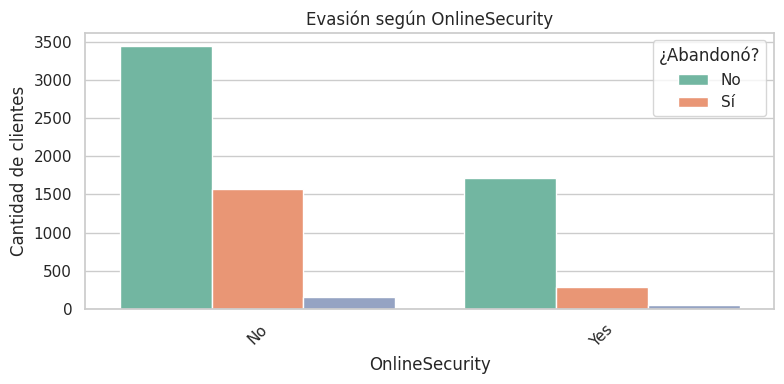
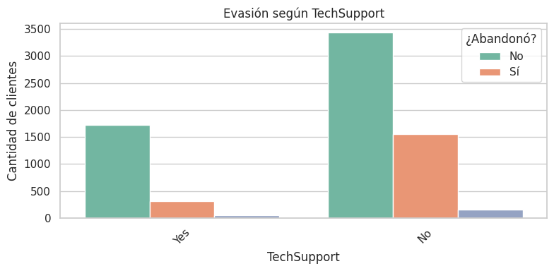

# <p align="center"><strong>📊 Proyecto Telecom X – Análisis de Evasión de Clientes</em> 🛒</strong><br>
<em>Este proyecto tiene como objetivo principal analizar los factores que influyen en la **evasión (churn)** de clientes de una empresa de telecomunicaciones. A través de herramientas de ciencia de datos como Python, Pandas, Matplotlib y Seaborn, se exploran patrones de comportamiento de los usuarios para proponer recomendaciones que ayuden a reducir la pérdida de clientes.</em></p>
## 🎯 Propósito del Análisis

- Identificar variables que afectan la evasión.
- Analizar el comportamiento de los clientes actuales vs. los que han abandonado.
- Generar insights valiosos para apoyar la toma de decisiones estratégicas.
- Establecer las bases para un futuro modelo predictivo.

---

## 📂 Estructura del Proyecto y Organización de Archivos

El proyecto está organizado de la siguiente manera:

```
TelecomX/
├── TelecomX_Data.json
├── TelecomX_diccionario.md
├── TelecomX_LATAM.ipynb
├── images/
│   ├── distribucion_evasion.png
│   ├── evasion_por_genero.png
|   ├── evasion_por_tipo_contrato.png
│   ├── evasion_por_metodo_pago.png
|   ├── evasion_por_servicio_internet.png
│   ├── evasion_por_seguridad_online.png
|   └── evasion_por_soporte_tecnico.png
│   ├──  README.md                  
```

- **`images/`**: Esta carpeta contiene las imágenes generadas a partir del análisis de datos, incluyendo gráficos, mapas y visualizaciones clave del proyecto.
  
- **`TelecomX_Data.json`**: Archivo con los datos de clientes y sus características
    
- **`TelecomX_diccionario.md`**: Diccionario de datos con explicación de cada variable

- - **`TelecomX_LATAM.ipynb`**: Notebook principal con análisis exploratorio y visualizaciones
    
- **`README.md`**: Este archivo, que estás leyendo ahora mismo, proporciona una descripción general del proyecto.
    

---


## 📈 Ejemplos de Gráficos e Insights Obtenidos

### 🔸 Distribución de Evasión (`distribucion_evasion.png`)
  
El 26.6% de los clientes abandonaron el servicio. Esta tasa de evasión es considerable y merece atención estratégica.

---

### 🔸 Evasión por Género (`evasion_por_genero.png`)
  
No se observan diferencias significativas entre hombres y mujeres en cuanto a evasión. Ambos géneros presentan tasas similares.

---

### 🔸 Evasión por Tipo de Contrato (`evasion_por_tipo_contrato.png`)
  
Los contratos **"Mes a Mes"** presentan una tasa de cancelación notablemente más alta. En cambio, los contratos a largo plazo ofrecen mayor retención.

---

### 🔸 Evasión por Método de Pago (`evasion_por_metodo_pago.png`)
  
Los clientes que pagan con **tarjeta de crédito** o **transferencia bancaria** tienden a permanecer más tiempo que los que usan medios electrónicos o cheques.

---

### 🔸 Evasión por Tipo de Servicio de Internet (`evasion_por_servicio_internet.png`)
  
Los clientes con **servicio de fibra óptica** muestran mayor evasión, posiblemente por precios más altos o fallas frecuentes.

---

### 🔸 Evasión por Seguridad en Línea (`evasion_por_seguridad_online.png`)
  
Los clientes **sin servicio de seguridad en línea** abandonan con más frecuencia. Este servicio puede ser un diferenciador de valor.

---

### 🔸 Evasión por Soporte Técnico (`evasion_por_soporte_tecnico.png`)
  
La evasión es mayor entre quienes **no tienen soporte técnico contratado**. Invertir en atención postventa puede mejorar la fidelización.

---

---

## 🚀 Instrucciones para Ejecutar el Notebook

Para ejecutar este análisis en tu entorno de Google Colab, sigue estos pasos:

1. **Abre el Notebook:** Ve a Google Colab y abre el archivo `TelecomX_LATAM.ipynb` (o el nombre que le hayas dado) desde tu repositorio de GitHub. Puedes ir a `File > Open notebook > GitHub` y pegar la URL de tu repositorio.
    
2. **Verifica las Librerías:** Asegúrate de que las librerías necesarias estén instaladas. El notebook utiliza `pandas`, `matplotlib` y `seaborn`. En Google Colab, estas librerías ya vienen preinstaladas en la mayoría de los casos. Si alguna no lo está, puedes instalarla con `!pip install <nombre_libreria>`.
    
3. **Ejecuta las Celdas:** Ejecuta cada celda del notebook secuencialmente.
    
    - La primera celda cargará los datos de las URLs, y realizará la limpieza y preparación de los datos para cada tienda..
        
    - Las secciones posteriores generarán los análisis y gráficos correspondientes a cada punto (Facturación, Categorías, Calificación, Productos, Envío, Extra).
        
4. **Revisa la Salida:** Observa las tablas de resultados impresas y los gráficos generados después de ejecutar cada sección. Estos te proporcionarán los _insights_ clave para el desafío.

