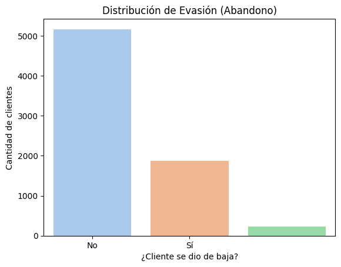

# <p align="center"><strong>📊 Proyecto Telecom X – Análisis de Evasión de Clientes</em> 🛒</strong><br>
<em>Este proyecto tiene como objetivo principal analizar los factores que influyen en la **evasión (churn)** de clientes de una empresa de telecomunicaciones. A través de herramientas de ciencia de datos como Python, Pandas, Matplotlib y Seaborn, se exploran patrones de comportamiento de los usuarios para proponer recomendaciones que ayuden a reducir la pérdida de clientes.</em></p>
## 🎯 Propósito del Análisis

- Identificar variables que afectan la evasión.
- Analizar el comportamiento de los clientes actuales vs. los que han abandonado.
- Generar insights valiosos para apoyar la toma de decisiones estratégicas.
- Establecer las bases para un futuro modelo predictivo.

---

## 📂 Estructura del Proyecto y Organización de Archivos

El proyecto está organizado de la siguiente manera:

```
TelecomX/
├── TelecomX_Data.json # Archivo con los datos de clientes y sus características
├── TelecomX_diccionario.md # Diccionario de datos con explicación de cada variable
├── TelecomX_LATAM.ipynb # Notebook principal con análisis exploratorio y visualizaciones
├── images/
│   ├── ingresos_por_tienda.png
│   ├── mapa_calor_ingresos.png
│   └── calificacion_promedio.png
├──  README.md                  
```

- **`images/`**: Esta carpeta contiene las imágenes generadas a partir del análisis de datos, incluyendo gráficos, mapas y visualizaciones clave del proyecto.
  
- **`base-de-datos-challenge1-latam/`**: Esta carpeta contiene los archivos CSV originales con los datos de ventas de cada una de las cuatro tiendas de Alura Store (`tienda_1.csv` a `tienda_4.csv`). Estos datos son la fuente principal para el análisis.
    
- **`AluraStoreLatam.ipynb`**: Este es el notebook principal (archivo de Google Colab o Jupyter) donde se realiza todo el análisis de datos. Contiene el código para cargar, limpiar, procesar y visualizar los datos, así como las conclusiones y recomendaciones.
    
- **`README.md`**: Este archivo, que estás leyendo ahora mismo, proporciona una descripción general del proyecto.
    

---

## 📊 Ejemplos de Gráficos e Insights Obtenidos


---

## 📈 Ejemplos de Gráficos e Insights Obtenidos

### 🔸 Distribución de Evasión (`distribucion_churn.png`)
  
El 26.6% de los clientes abandonaron el servicio. Esta tasa de evasión es considerable y merece atención estratégica.

---

### 🔸 Correlación entre Variables (`correlacion_variables.png`)
  
Se observa una alta correlación positiva entre la evasión y factores como:
- **Meses como cliente (tenure)**: los clientes nuevos tienden a abandonar más rápido.
- **Ingresos mensuales bajos** también se asocian con mayor evasión.
- Contratos mensuales tienen mayor probabilidad de evasión frente a contratos anuales.

---

### 🔸 Ingresos Mensuales vs Churn (`ingresos_vs_churn.png`)
  
Los clientes con ingresos mensuales bajos son más propensos a cancelar el servicio.

---

### 🔸 Tipo de Contrato vs Churn (`contratos_vs_churn.png`)
  
Los contratos de tipo "Mes a Mes" tienen la mayor tasa de cancelación, mientras que los contratos a largo plazo retienen mejor a los clientes.

---

### 🔸 Número de Servicios Contratados (`servicios_vs_churn.png`)
  
Cuantos más servicios tiene un cliente, menor es su probabilidad de evasión. Ofrecer paquetes integrados puede ser una buena estrategia de retención.

---

## 🧪 Cómo Ejecutar el Notebook

1. Asegúrate de tener Python 3.8+ y Jupyter Notebook instalado.
2. Clona este repositorio o descarga los archivos.
3. Instala las dependencias necesarias:
   ```bash
   pip install pandas matplotlib seaborn

